# 🚀 SkillSwap - AWS Full-Stack Application

[](https://github.com/marwaniiwael18/AWS-App/actions)
[](http://skillswap-frontend-prod.s3-website-eu-north-1.amazonaws.com)
[](https://jm11mtpkb9.execute-api.eu-north-1.amazonaws.com/prod)
[](https://aws.amazon.com)

A modern skill-sharing platform built with React and Node.js, deployed on AWS serverless infrastructure with professional CI/CD pipeline.

## 🌐 Live Application

| Service | URL | Status |
|---------|-----|--------|
| 🌠**Frontend** | [skillswap-frontend-prod.s3-website-eu-north-1.amazonaws.com](http://skillswap-frontend-prod.s3-website-eu-north-1.amazonaws.com) |  |
| 🔗 **Backend API** | [jm11mtpkb9.execute-api.eu-north-1.amazonaws.com/prod](https://jm11mtpkb9.execute-api.eu-north-1.amazonaws.com/prod) |  |
| 📚 **API Docs** | [API Documentation](https://jm11mtpkb9.execute-api.eu-north-1.amazonaws.com/prod/api/docs) |  |

## 📋 Table of Contents

- [🚀 Quick Start](#-quick-start)
- [🏗️ Architecture](#-architecture)
- [🛠️ Technology Stack](#-technology-stack)
- [📦 Features](#-features)
- [🔧 Local Development](#-local-development)
- [☁️ AWS Infrastructure](#-aws-infrastructure)
- [🚀 Deployment](#-deployment)
- [🔒 Security](#-security)
- [📊 Monitoring](#-monitoring)
- [🤝 Contributing](#-contributing)

## 🚀 Quick Start

### Check Application Status
```bash
# Clone the repository
git clone https://github.com/marwaniiwael18/AWS-App.git
cd AWS-App

# Check current application status
./get-urls.sh
```

### Fix Frontend (if needed)
```bash
# Make the script executable
chmod +x manual-frontend-fix.sh

# Run the frontend fix script (requires AWS CLI configured)
./manual-frontend-fix.sh
```

## 🏗️ Architecture

```mermaid
graph TB
    User[👤 User] --> CF[🌐 CloudFront CDN]
    CF --> S3[📦 S3 Static Website]
    S3 --> API[🔗 API Gateway]
    API --> Lambda[⚡ AWS Lambda]
    Lambda --> DDB[💾 DynamoDB]
    Lambda --> S3Files[📁 S3 Files]
    Lambda --> Cognito[🔐 AWS Cognito]
    
    GitHub[📚 GitHub] --> Actions[🔄 GitHub Actions]
    Actions --> Deploy[🚀 Serverless Deploy]
    Deploy --> Lambda
    Deploy --> S3
```



## 🛠️ Technology Stack

### Frontend
- **React 18** - Modern UI library
- **Tailwind CSS** - Utility-first CSS framework
- **Vite** - Fast build tool and dev server
- **React Router** - Client-side routing
- **Axios** - HTTP client for API calls

### Backend
- **Node.js 18** - JavaScript runtime
- **Express.js** - Web application framework
- **Serverless Framework v3** - Infrastructure as Code
- **AWS SDK v3** - AWS service integration
- **JWT** - JSON Web Token authentication

### AWS Services
- **🔗 API Gateway** - RESTful API endpoints
- **⚡ AWS Lambda** - Serverless compute
- **💾 DynamoDB** - NoSQL database
- **📦 S3** - Object storage & static hosting
- **🔐 AWS Cognito** - User authentication
- **☁️ CloudFormation** - Infrastructure provisioning

### DevOps
- **GitHub Actions** - CI/CD pipeline
- **Serverless Framework** - Deployment automation
- **ESLint + Prettier** - Code quality
- **Jest** - Testing framework

## 📦 Features

### 🎯 Core Features
- ✅ **User Authentication** - AWS Cognito integration
- ✅ **Skill Matching** - Advanced algorithm for skill pairing
- ✅ **Real-time Messaging** - User communication system
- ✅ **Profile Management** - Comprehensive user profiles
- ✅ **Skill Categories** - Organized skill classification
- ✅ **Rating System** - User feedback and ratings

### 🔒 Security Features
- ✅ **JWT Authentication** - Secure token-based auth
- ✅ **CORS Protection** - Cross-origin request security
- ✅ **Input Validation** - Server-side data validation
- ✅ **AWS IAM** - Fine-grained access control
- ✅ **Environment Variables** - Secure configuration management

### 🚀 DevOps Features
- ✅ **Automated Testing** - Unit and integration tests
- ✅ **CI/CD Pipeline** - Automated deployment
- ✅ **Infrastructure as Code** - Reproducible deployments
- ✅ **Health Monitoring** - Application health checks
- ✅ **Error Handling** - Comprehensive error management

## 🔧 Local Development

### Prerequisites
- Node.js 18+ 
- npm or yarn
- AWS CLI (for deployment)
- Git

### Setup
```bash
# Clone repository
git clone https://github.com/marwaniiwael18/AWS-App.git
cd AWS-App

# Install backend dependencies
cd backend
npm install

# Install frontend dependencies
cd ../frontend
npm install

# Set up environment variables
cp .env.example .env.local
# Edit .env.local with your configuration
```

### Development Servers
```bash
# Start backend (from backend directory)
npm run dev
# Backend runs on http://localhost:3000

# Start frontend (from frontend directory)
npm run dev
# Frontend runs on http://localhost:5173
```

### Environment Variables

#### Backend (.env)
```env
NODE_ENV=development
COGNITO_USER_POOL_ID=your_user_pool_id
COGNITO_CLIENT_ID=your_client_id
JWT_SECRET=your_jwt_secret
BYPASS_AUTH=true  # For development only
```

#### Frontend (.env.local)
```env
VITE_API_URL=http://localhost:3000
VITE_BYPASS_AUTH=true  # For development only
```

## ☁️ AWS Infrastructure

### Deployed Resources
- **API Gateway**: RESTful API endpoints
- **Lambda Functions**: Serverless compute for all API routes
- **DynamoDB Tables**: 
  - Users, Matches, Messages, Ratings
  - Global Secondary Indexes for efficient querying
- **S3 Buckets**: 
  - Static website hosting (frontend)
  - File storage (user uploads)
- **AWS Cognito**: User authentication and management
- **CloudFormation Stacks**: Infrastructure management

### Regions and Availability
- **Primary Region**: eu-north-1 (Stockholm)
- **Backup Strategy**: Cross-region replication configured
- **CDN**: CloudFront for global content delivery

## 🚀 Deployment

### Automated Deployment (Recommended)
The application deploys automatically via GitHub Actions on every push to `main`:

1. **Tests** - Run unit and integration tests
2. **Build** - Create production builds
3. **Deploy Backend** - Serverless Framework deployment to AWS Lambda
4. **Deploy Frontend** - Static files to S3 with website hosting
5. **Smoke Tests** - Verify deployment health

### Manual Deployment

#### Backend
```bash
cd backend
npm install
serverless deploy --stage prod --region eu-north-1
```

#### Frontend
```bash
cd frontend
npm install
npm run build
aws s3 sync dist/ s3://skillswap-frontend-prod/ --delete
```

#### Fix Frontend Issues
```bash
# If frontend is not accessible, run the fix script
chmod +x manual-frontend-fix.sh
./manual-frontend-fix.sh
```

### Environment Management
- **Development**: Local environment with mock services
- **Staging**: AWS environment for testing (staging branch)
- **Production**: Live AWS environment (main branch)

## 🔒 Security

### Authentication Flow
1. User registers/logs in via AWS Cognito
2. Cognito returns JWT tokens
3. Frontend stores tokens securely
4. Backend validates JWT on each request
5. AWS IAM controls service permissions

### Security Measures
- **HTTPS Only** - All communication encrypted
- **CORS Configuration** - Restricted origins
- **Input Sanitization** - Prevent injection attacks
- **Rate Limiting** - API abuse prevention
- **Secrets Management** - AWS Parameter Store integration

## 📊 Monitoring

### Health Checks
```bash
# Check application status
./get-urls.sh

# Test backend health
curl https://jm11mtpkb9.execute-api.eu-north-1.amazonaws.com/prod/health

# Test frontend
curl http://skillswap-frontend-prod.s3-website-eu-north-1.amazonaws.com
```

### Metrics and Logging
- **CloudWatch Logs** - Application and Lambda logs
- **CloudWatch Metrics** - Performance monitoring
- **API Gateway Metrics** - Request/response analytics
- **Custom Dashboards** - Business metrics tracking

## 🛠️ Troubleshooting

### Common Issues

#### Frontend Not Accessible
```bash
# Run the manual fix script
./manual-frontend-fix.sh
```

#### Backend API Errors
```bash
# Check CloudWatch logs
aws logs describe-log-groups --region eu-north-1

# Check Lambda function status
aws lambda get-function --function-name skillswap-backend-prod-app
```

#### Deployment Failures
1. Check GitHub Actions logs
2. Verify AWS credentials
3. Check CloudFormation stack status
4. Review Serverless Framework logs

### Support
- 📧 Email: [your-email@domain.com]
- 🐛 Issues: [GitHub Issues](https://github.com/marwaniiwael18/AWS-App/issues)
- 📚 Documentation: [GitHub Wiki](https://github.com/marwaniiwael18/AWS-App/wiki)

## 🤝 Contributing

1. Fork the repository
2. Create a feature branch (`git checkout -b feature/amazing-feature`)
3. Commit your changes (`git commit -m 'Add amazing feature'`)
4. Push to the branch (`git push origin feature/amazing-feature`)
5. Open a Pull Request

### Development Guidelines
- Follow existing code style
- Add tests for new features
- Update documentation
- Ensure CI/CD pipeline passes

## 📈 Project Status

- ✅ **Backend API**: Fully operational
- ⚠️ **Frontend**: Needs S3 configuration fix (use manual-frontend-fix.sh)
- ✅ **CI/CD Pipeline**: Automated deployment working
- ✅ **Database**: DynamoDB tables created and configured
- ✅ **Authentication**: AWS Cognito integration complete

## 📄 License

This project is licensed under the MIT License - see the [LICENSE](LICENSE) file for details.

## 🙏 Acknowledgments

- AWS for providing excellent serverless infrastructure
- React team for the amazing frontend framework
- Serverless Framework for simplifying AWS deployments
- Tailwind CSS for beautiful, utility-first styling

---

**Built with ❤️ using AWS and modern web technologies**

*Last updated: $(date +'%Y-%m-%d')*
